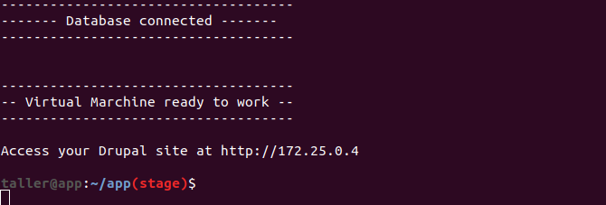

## Project Name

Brief project description

## Table of contents

A Table of contents can help people to find a specific topic, making things faster and easier.

- [Requirements](#requirements)
- [Local Setup](#local-setup)
- [Available Commands](#available-commands)
	- [Make Commands](#make-commands)
	- [Yarn Commands](#yarn-commands)
- [Environment Variables](#environment-variables)
- [Useful References](#useful-references)
- [Details about other things](#details-about-other-things)

## Requirements

In this section we must describe every requirement necessary to run this project (and its version if it is a software or libs), for example:

- Docker >= 19.03
- Docker Compose >= 1.23
- Node >= 10.15

## Local Setup

In this section we must provide all the required steps to be able to execute the project in a local environment, for example:

**1 - Clone this repository using the command below:**

`$ git clone git@bitbucket.org:taller-repo/project-name.git`

**2 - Access the directory with the project**

`$ cd project-name`

**3 - Build and Run the project**

At this step, we will build the docker image and run in sequence. To do that we'll exe te the follo ng comman:

`$ make run`

At the end of the process you should see this output **(You can use images or even gifs to make things more clear)**:

**... and so on**

## Available Commands

Here, we can describe all the available commands in this project, this way we don't need to search inside files every time. We can separate commands by groups as well (make commands, yarn commands, etc), for example:

#### Make Commands

Command  | Description
------------- | -------------
make run  | Run the project
make stop  | Stop and remove containers
make xdebug  | Enables XDebug

#### Yarn Commands

Command  | Description
------------- | -------------
**yarn dev**  | Run the frontend application
**yarn test** | Execute automated tests

## Environment Variables

We can describe the environment variables used in this project.

Variable  | Description
------------- | -------------
**GRAPHQL_HOST**  | The GraphQL endpoint
**PRODUCTION** | Whether we are executing the application in production environment or not. **(True or False)**

## Useful References

Here, we can list useful references to this project. For instance, maybe we have some diagrams or even additional documentation that can help in specific moments. So, we can list they here. For example:

- [Solr - Sequence Diagram](http://www.notion.com/xpto)

## Details about other things

We can also describe specific processes related to each project. For example, if a project has automated tests we can describe how to run then or even how they are organized. This way, we can create a topic **Tests** to detail all these things.

